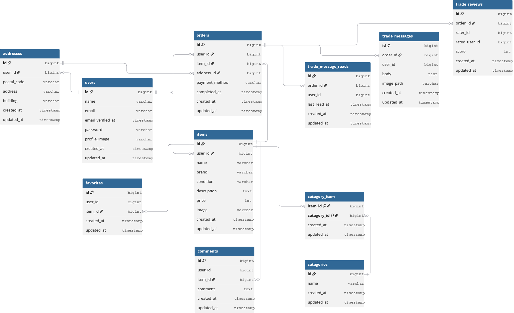

# coachtech-fleamarket

COACHTECH の フリマアプリケーションです。
会員登録、商品出品・購入、コメント・お気に入りなどの機能を備えています。

---

## 環境構築

### Docker ビルド

1. `git clone https://github.com/kie-okamoto/coachtech-fleamarket.git`
2. Docker Desktop アプリを立ち上げる
3. `docker compose up -d --build`

### Laravel 環境構築

1. `docker compose exec app bash`
2. `composer install`
3. `.env.example` を `.env` にコピーまたは新規作成
4. `.env` に以下を追加（DB 設定など）

````env
DB_CONNECTION=mysql
DB_HOST=mysql
DB_PORT=3306
DB_DATABASE=laravel_db
DB_USERNAME=laravel_user
DB_PASSWORD=laravel_pass

# Stripeの設定について

- Stripeの「公開キー」「秘密キー」は `.env` ファイルに記載（Gitなど公開リポジトリには含めない）

```env
STRIPE_KEY=your_stripe_public_key_here
STRIPE_SECRET=your_stripe_secret_key_here

MAIL_MAILER=smtp
MAIL_HOST=mailhog
MAIL_PORT=1025
MAIL_FROM_ADDRESS=example@example.com
MAIL_FROM_NAME="Fleamarket"
````

5. アプリケーションキーの作成 `php artisan key:generate`
6. マイグレーションの実行 `php artisan migrate`
7. シーディングの実行 `php artisan db:seed`
8. ストレージリンクの作成 `php artisan storage:link`

### テストの実行方法

1. .env をコピーして .env.testing を作成 `cp .env .env.testing`

```env
APP_NAME=Laravel
APP_ENV=testing
APP_KEY=base64:xxxxxxxxxxxxxxxxxxxxxxxxxxxxxxxxxxxxxxxxxxx=
APP_DEBUG=true
APP_URL=http://localhost

LOG_CHANNEL=stack
LOG_LEVEL=debug

DB_CONNECTION=sqlite
DB_DATABASE=:memory:

CACHE_DRIVER=array
SESSION_DRIVER=array
QUEUE_CONNECTION=sync

MAIL_MAILER=smtp
MAIL_HOST=mailhog
MAIL_PORT=1025
MAIL_USERNAME=null
MAIL_PASSWORD=null
MAIL_ENCRYPTION=null
MAIL_FROM_ADDRESS=null
MAIL_FROM_NAME="${APP_NAME}"

FILESYSTEM_DRIVER=local
BROADCAST_DRIVER=log

REDIS_HOST=127.0.0.1
REDIS_PASSWORD=null
REDIS_PORT=6379

MOCK_STRIPE=true
```

2. テスト実行 `php artisan test`

## 使用技術

- Laravel 8.83.8
- PHP 8.1.32
- MySQL 8.0.26
- Docker / Docker Compose
- Laravel Fortify（メール認証あり）
- Stripe Checkout（カード・コンビニ決済対応）
- Mailhog（開発用メール送信確認）

## ER 図



## URL

- 開発環境: http://localhost/
- phpMyAdmin: http://localhost:8080/
- Mailhog（メール確認）: http://localhost:8025/
